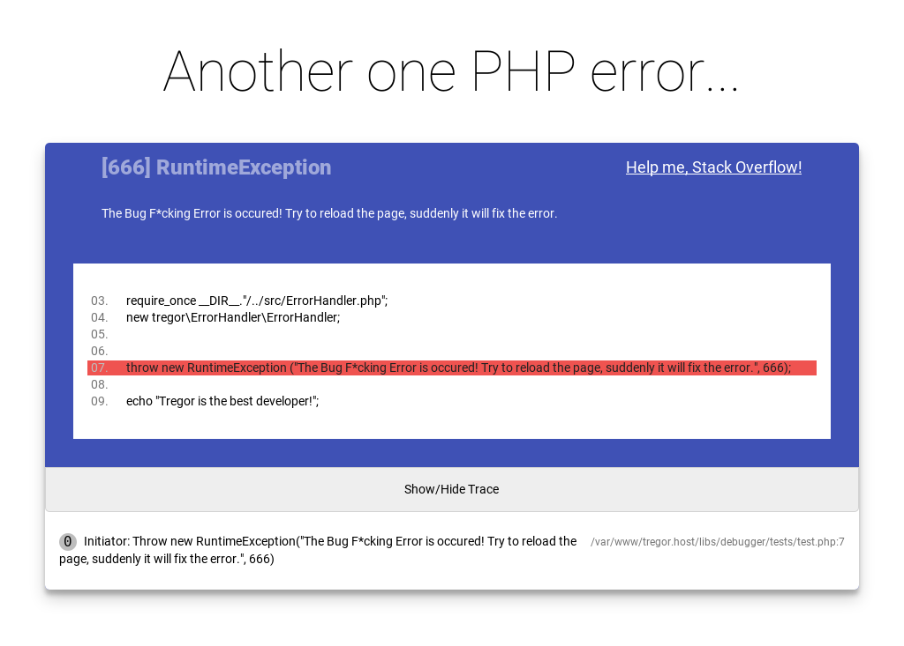
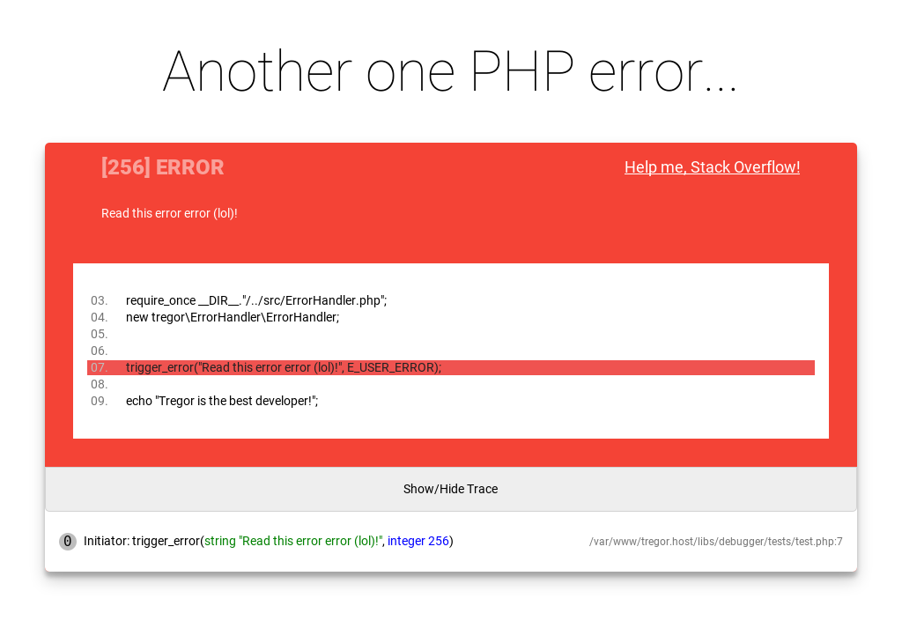
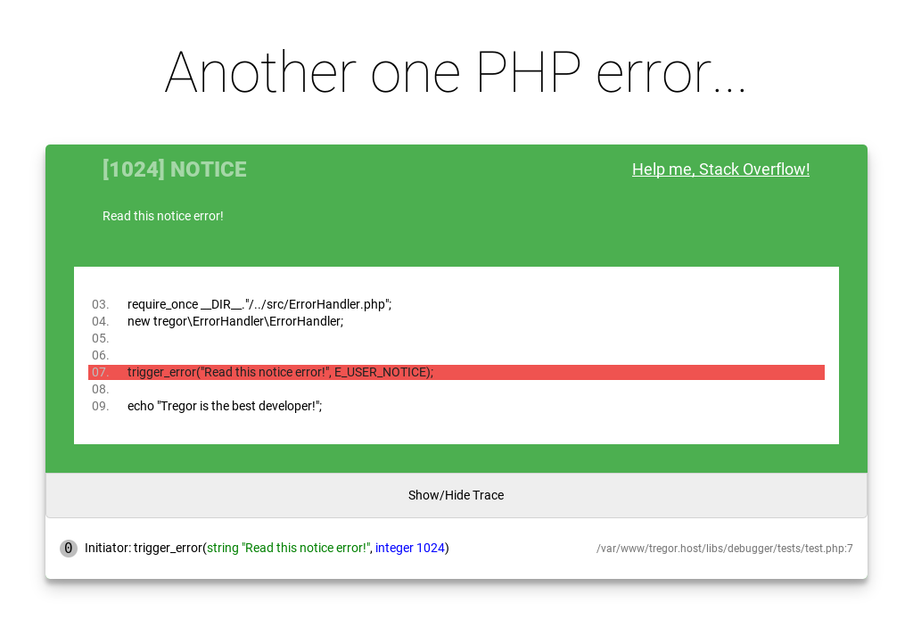
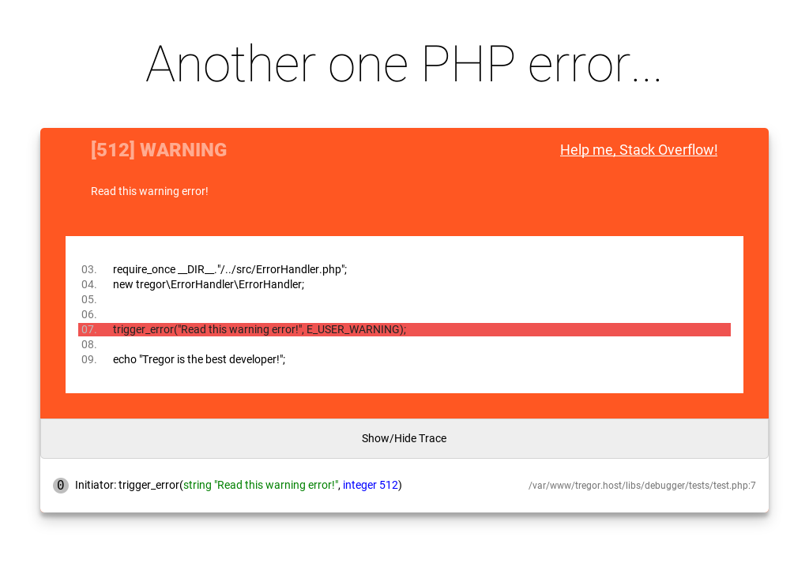

# Beautiful and informative PHP Error Handler!

[](https://packagist.org/packages/tregor/error-handler)
[](https://github.com/tregor/ErrorHandler)
[](https://github.com/tregor/ErrorHandler)
[](https://packagist.org/packages/tregor/error-handler)
[](LICENSE)


PHP library for handling exceptions and errors! (Now with direct href to StackOverflow :wink: )

> **Debug is never been so cool and easy!😃**
> 
> *(C) Bill Gates*

> **Make handlers great again!😎**
> 
> *(C) Steve Jobs*

> **I have sex with that library!!!😍**
> 
> *(C) Bill Clinton*

> **Okay, let's see what this library can...😏**
> 
> *(C) Typical Programmer*

This library turns debugging from a boring and monotonous work into a simple and easy process with a beautiful interface and smart error tracking!

According to the fictional statistics, when using this library, the fix of errors occurs in 87.13% faster compared to without the library!

If you start using this library right now, then we will give you access to the StackOverflow website for 1 year ABSOLUTELY FREE!

We will also give you the certificate of "BaD DeV" if you recommend this library to your friends!

And finally: this is my first public library, which is not made of shit and sticks. Thanks for using!:blush:

---
## Navigation
- [Requirements](#requirements)
- [Installation](#installation)
- [Available Methods](#available-methods)
- [Quick Start](#quick-start-and-usage)
- [Images](#images)
- [TODO](#todo)
- [Contribute](#contribute)
- [License](#license)
- [Copyright](#copyright)

---

## Requirements

This library is supported by **PHP versions 5.4** or higher.

## Installation

The preferred way to install this extension is through [Composer](http://getcomposer.org/download/).

To install **PHP ErrorHandler library**, simply:

    $ composer require tregor/error-handler

You can also **clone the complete repository** with Git:

    $ git clone https://github.com/tregor/ErrorHandler.git

Or **install it manually**:

[Download ErrorHandler.php](https://github.com/tregor/ErrorHandler/archive/master.zip):

    $ wget https://github.com/tregor/ErrorHandler/archive/master.zip

## Available Methods

Available methods in this library:

### - Set renderer template:

To set custom renderer template, that you can download appart or create yourself, you must provide those code:
```php
ErrorHandler::setTemplate(string $templateName);
```

### - Set trace depth:

By default trace depth is 0, equivalent to infinity. You can set trace steps depth by providing those code:
```php
ErrorHandler::setTraceDepth(integer $traceDepth);
```


## Quick Start and Usage

To use this class with **Composer**:

```php
require __DIR__ . '/vendor/autoload.php';

new tregor\ErrorHandler\ErrorHandler;
```

Or If you installed it **manually**, use it:

```php
require_once __DIR__ . '/ErrorHandler.php';

new tregor\ErrorHandler\ErrorHandler;
```

## Images


**EXCEPTION Handler:**


**ERROR Handler:**


**WARNING Handler:**


**NOTICE Handler:**


## TODO

- [X] Make some settings.
- [X] Improve documentation.
- [ ] Add enviroment variables on debug page.
- [ ] Include CLI version of error respond.
- [ ] Refactor code.
- [ ] Make it better.
- [ ] Take a cup of coffee.

## Contribute

If you would like to help, please take a look at the list of
[issues](https://github.com/tregor/ErrorHandler/issues) or the [ToDo](#todo) checklist.

**Pull requests**

* [Fork and clone](https://help.github.com/articles/fork-a-repo).
* Run the **tests**.
* Create a **branch**, **commit**, **push** and send me a
  [pull request](https://help.github.com/articles/using-pull-requests).

## License

This project is licensed under **MIT license**. See the [LICENSE](LICENSE) file for more info.

## Copyright

By tregor 2019

Please let me know if you have feedback or suggestions.

You can contact me on [Telegram](https://t.me/tregor) or through my [email](mailto:tregor1997@gmail.com).